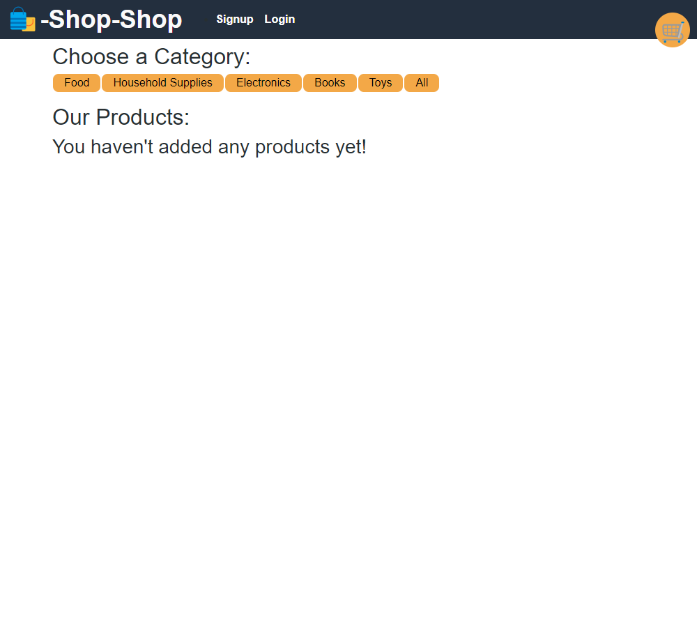

# Ecommerce with Redux

## Description

Using an existing project using the useContext hook to control state, I refactored the app to use React Redux.

## Screenshot

## Table of Contents

1. [Installation](#installation)
2. [Usage](#usage)
3. [License](#license)
4. [Contributing](#contributing)
5. [Tests](#tests)

## Installation

1. Clone the repository to your local machine.
2. Run `npm install` to install the dependencies.
3. Run `npm run develop` to start the application on your local machine.

## Usage

Use this project to explore the changes necessary to install Redux and refactor components and store.

## License

This project is covered under the MIT license. For more information, click the link below.
[License Link](https://opensource.org/licenses/MIT)

## Contributing

Starter code was provided by the GWU Full-Stack Bootcamp.

## Questions

Have questions about this project? Please see my Github profile at https://github.com/dwalley606.

You can also send me an email at dwalley606@gmail.com.
